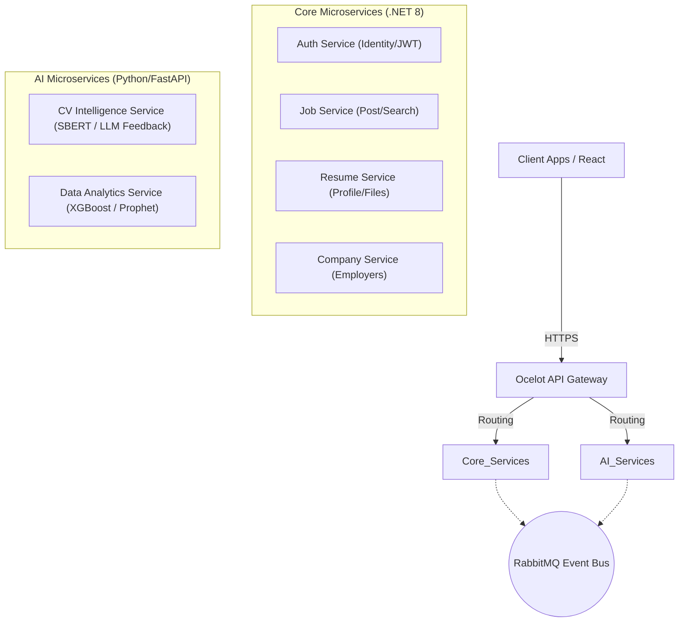

<div align="center">
  
  # 🚀 JobHub - Enterprise Recruitment Microservices System
  
  **Hệ Sinh Thái Tuyển Dụng Thông Minh Tích Hợp AI Mức Độ Chuyên Sâu**
  
  [](https://dotnet.microsoft.com/)
  [](https://python.org)
  [](https://fastapi.tiangolo.com)
  [](https://docker.com)
  
</div>

---

## 📖 Giới Thiệu
**JobHub Backend** là trái tim của hệ thống tuyển dụng thế hệ mới, được thiết kế theo kiến trúc **Microservices** tiên tiến. Hệ thống phân rã các miền nghiệp vụ thành các dịch vụ độc lập, giúp dễ dàng mở rộng, bảo trì và triển khai. Đặc biệt, JobHub tiên phong ứng dụng các thuật toán **Học Sâu (Deep Learning)** và **Mô hình Ngôn ngữ Lớn (LLM)** vào quy trình sàng lọc kỹ năng và gợi ý việc làm.

## 🏗️ Kiến Trúc Hệ Thống (Architecture)



---

## 🧩 Các Components (Microservices)

### 1. 🛡️ Core Services (.NET 8 C#)
Các dịch vụ lõi đảm nhiệm vận hành các nghiệp vụ cơ bản, giao tiếp qua gRPC và Message Broker.

* **`AuthService`**: Trung tâm quản lý định danh. Xác thực người dùng (Candidates, Employers, Admin) bằng JWT, phân quyền cấp độ sâu (Role-based & Policy-based).
* **`JobService`**: Quản lý vòng đời bài tuyển dụng. Hỗ trợ tìm kiếm toàn văn bản (Full-text search), lọc nâng cao theo kỹ năng, địa điểm.
* **`ResumeService`**: Quản lý hồ sơ số. Xử lý lưu trữ an toàn các file PDF/Word, chuẩn hóa data đầu vào.
* **`CompanyService`**: Quản lý thông tin doanh nghiệp, xác thực đăng ký nhà tuyển dụng, cấp phép đăng bài.

### 2. 🧠 AI & Data Services (Python FastAPI)
Module thông minh tạo ra sự khác biệt (USP) cho nền tảng.

* **`CV Intelligence Service`**: Trái tim AI của hệ thống.
  * **Chấm điểm & Khớp JD (Semantic Scoring):** Sử dụng mô hình *SBERT/Siamese Network* kết hợp kỹ thuật truy xuất `Cosine Similarity` để đo độ phù hợp ngữ nghĩa chứ không chỉ so khớp từ khóa. Tốc độ <2s cho hàng ngàn CV.
  * **Sinh Nhận xét (LLM Feedback):** Pipeline 2-Stage. Gửi Top CV tiềm năng qua Prompt Engineering với GPT-4/Llama-3 để sinh báo cáo chuyên sâu tự động gửi tới bộ phận nhân sự.
* **`Data Analytics Service`**:
  * **Gợi ý việc làm (Recommendation):** Lọc cộng tác bằng Matrix Factorization (SVD) kết hợp Lọc theo nội dung.
  * **Dự báo mức lương (Salary Prediction):** Áp dụng mô hình Cây quyết định *XGBoost/Random Forest* để ước lượng lương realtime theo kinh nghiệm & location.
  * **Dự báo xu hướng (Trend Forecasting):** Ứng dụng mô hình chuỗi thời gian phân tích độ "hot" của công nghệ theo các Quý.

---

## 🛠️ Công Nghệ Sử Dụng (Tech Stack)

| Lớp (Layer) | Công nghệ / Framework |
| :--- | :--- |
| **Backend Core** | C# .NET 8, ASP.NET Core Web API, EF Core |
| **Backend AI** | Python 3.10, FastAPI, Uvicorn, SQLAlchemy |
| **Machine Learning** | PyTorch, HuggingFace, Scikit-learn, XGBoost |
| **Database** | PostgreSQL (Relational), MongoDB (Document) |
| **Message Broker** | RabbitMQ (Asynchronous Communication) |
| **API Gateway** | Ocelot / YARP |
| **DevOps** | Docker, Docker Compose |

---

## 🚀 Hướng Dẫn Cài Đặt và Chạy Dự Án (Local Development)

Hệ thống được thiết kế để `Plug-and-Play` thông qua Docker Compose. Bạn không cần cài đặt rườm rà tất cả các runtime môi trường vào máy thật.

### 1. Yêu Cầu Cần Có
- **Docker Desktop** (Đang chạy).
- **Git** (Để clone source code).

### 2. Triển Khai Trong 1 Cú Nhấp
Mở Terminal/CMD tải thư mục gốc dự án và chạy:

```bash
# Di chuyển vào thư mục Backend
cd /path/to/TryHard_IT_Project/Final/Backend

# Khởi chạy hệ thống nền (Database, RabbitMQ)
docker-compose up -d postgresql rabbitmq mongodb

# Đợi 10 giây để DB sẵn sàng, sau đó khởi chạy toàn bộ Hệ thống Microservices
docker-compose up -d --build
```

### 3. Cổng Dịch Vụ Mặc Định (Ports)
Để test sau khi khởi chạy xong, hãy truy cập các Swagger UI (Tài liệu API API) mặc định trên trình duyệt:

- 🌍 **API Gateway Entry:** `http://localhost:5000`
- 🛡️ **Auth Service (Swagger):** `http://localhost:5001/swagger`
- 💼 **Job Service (Swagger):** `http://localhost:5002/swagger`
- 📑 **CV Intelligence AI (FastAPI Docs):** `http://localhost:8001/docs`
- 📊 **RabbitMQ Management Dashboard:** `http://localhost:15672` *(guest / guest)*

---

## 📁 Cấu Trúc Thư Mục
```text
Backend/
├── JobHub/                  # Chứa toàn bộ Solution Core .NET và Python Microservices
│   ├── ApiGateway/
│   ├── AuthService/
│   ├── CompanyService/
│   ├── JobService/
│   ├── ResumeService/
│   ├── CVIntelligenceService/   # Python AI Module 1
│   ├── DataAnalyticsService/    # Python AI Module 2
│   └── JobHub.slnx          # File quản lý Solution tổng
├── docker-compose.yml       # File khởi chạy toàn mạng lưới Docker
└── README.md                # File bạn đang đọc
```

---
<div align="center">
  <i>Hệ thống được kiến trúc theo tiêu chuẩn Microservices của các doanh nghiệp Công nghệ hàng đầu thế giới.</i>
</div>
